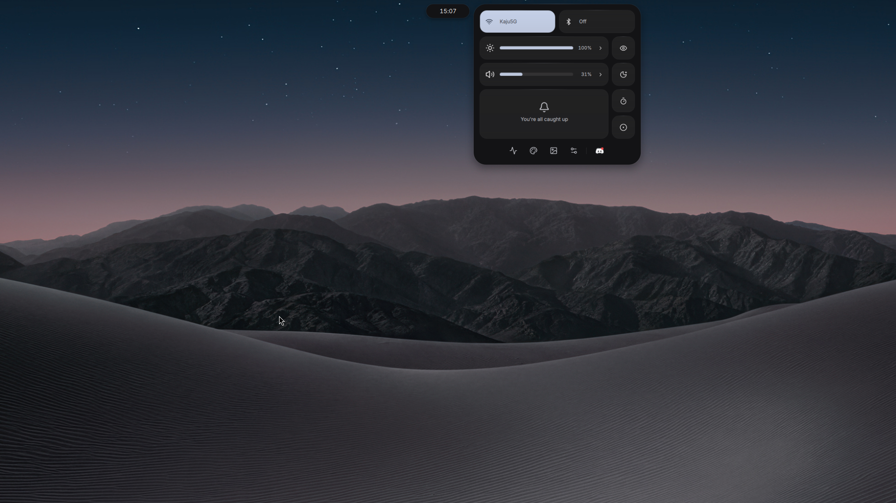
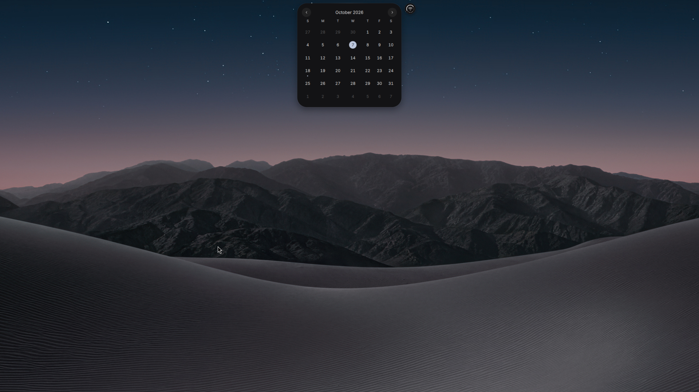
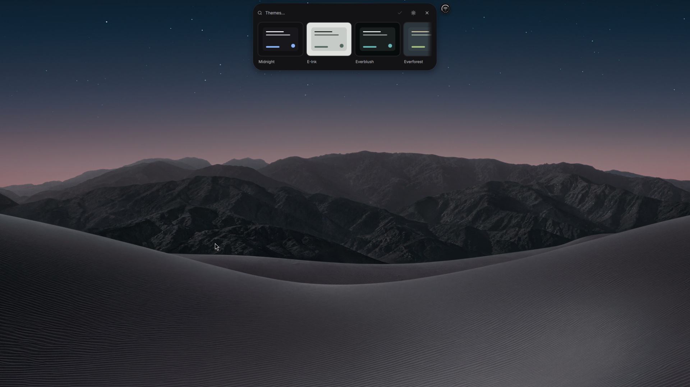
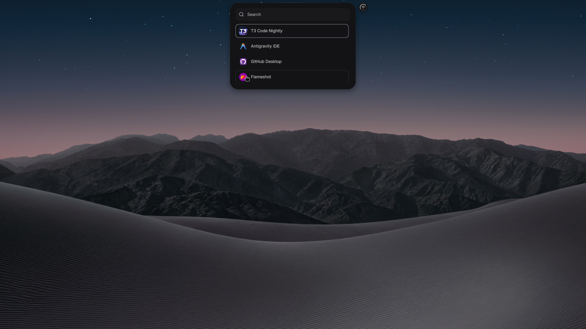
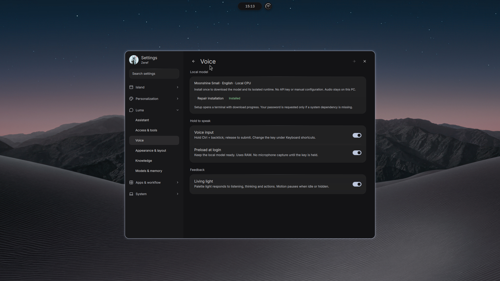

# Modesty

A Quickshell desktop for Arch Linux and Hyprland. Three small pills expand into
media controls, a calendar and a control center, with a launcher, Luma search and
assistant, notifications, a lock screen and a window companion.



**[Install](#install) · [Use](#use) · [Update](#update) ·
[Screenshots and video](#screenshots-and-video) · [Uninstall](#uninstall-and-restore) ·
[Contribute](#contribute) · [Get help](https://github.com/sandeepbist/Modesty/issues/new/choose)**

## Install

You need **x86_64 Arch Linux**, working graphics drivers, a normal user account,
internet access and sudo. Modesty installs desktop configs and dependencies;
it does not install Arch, graphics drivers, a bootloader or a login manager.

```sh
sudo pacman -Syu --needed git
git clone https://github.com/sandeepbist/Modesty.git ~/App/Modesty
cd ~/App/Modesty
./install.sh
```

Run as your desktop user, **not root**. The interactive installer explains proposed
changes and asks for approval. Change approvals default to **No**; files and backup
locations are shown before config replacement.

| Installer choice | What it sets up |
| --- | --- |
| Required dependencies | Arch packages and NetworkManager/Bluetooth services |
| Configs | Desktop, shell, apps, bundled fonts and Spotify theme |
| Wallpapers | Supplied collection, or keep your existing wallpaper and palette |
| Optional plugins | Dynamic cursor effects and Super + Tab window overview |
| Optional local voice | Moonshine Small English speech recognition for Luma |
| Optional extras | AUR apps, Spotify tools and extra fonts |

After installation, **log out and select Hyprland** in your login manager, or run
`start-hyprland` from a TTY. Keep the checkout at the same path: startup and
shortcuts use it.

<details>
<summary>Install previews, backups and path requirements</summary>

- Use `--dry-run` to preview changes without writing anything: `./install.sh --dry-run`.
- Existing files are backed up before replacement. Package installation uses a
  full Arch update; AUR apps and local voice are separate choices.
- Declining or cancelling stops that step. Earlier approved package, service and
  model changes are retained; file rollback only restores configs.
- `--non-interactive` explicitly approves all saved configs, but refuses missing
  dependencies, disabled services and Qt repairs instead of fixing them silently.
- Home and checkout paths must not contain whitespace. This profile uses
  `~/.config`; unset `XDG_CONFIG_HOME` before installing.
- Destination parent directories must be real directories, not symlinks. The
  installer refuses redirected paths before replacing files.
- The profile uses Hyprland's Lua configuration. Set monitor arrangement, scale,
  brightness permissions and suspend/hibernate support for your hardware.
- Firefox, Pavucontrol and Adwaita cursors are defaults; installed Zen and
  Pwvucontrol take priority.
- Spotify needs a separate installation and first launch before
  `spicetify backup apply`.

</details>

<details>
<summary>Optional cursor effects and window overview</summary>

- The installer asks separately about
  [dynamic cursor effects](https://github.com/VirtCode/hypr-dynamic-cursors) and
  [window overview](https://github.com/yayuuu/hyprland-scroll-overview). It builds
  and enables selected plugins through `hyprpm`, with Modesty's settings.
- On a fresh TTY install, setup finishes after your first Hyprland login. A
  terminal opens automatically; enter your sudo password if requested.
- The terminal lists selected repositories and asks before building, enabling or
  reloading plugins. Declining keeps the selection pending.
- Plugin compatibility depends on upstream. Both plugins are optional; a failed
  upstream build leaves the desktop usable. Run `hyprpm update` after compositor
  updates.

Retry setup from the checkout after checking Hyprland compatibility:

```sh
python3 install.py --finish-plugins
```

</details>

<details>
<summary>Optional local voice: installation and privacy</summary>

Choose voice during installation, or open **Settings → Luma → Voice → Install
local voice**. The panel also offers repair/retry. Terminal setup uses the same
installer:

```sh
python3 install.py --install-voice
```

- Setup downloads and verifies Moonshine Small English and installs an isolated
  CPU runtime. Models and the Python environment stay outside the checkout.
- Hold **Ctrl + backtick** to speak to Luma; release to submit. Transcription runs
  locally and needs no API key.
- Voice loads on demand; Settings can keep it ready.
- **AI answers use your configured cloud provider.** Submitted speech becomes
  text sent to that provider, together with enabled context and tool results.
  Local speech recognition does not make the assistant itself local.
- Application launching, calculations and local search work without an AI key.

</details>

## Use

| Input | Opens |
| --- | --- |
| Album-art pill | Media controls |
| Clock pill | Clock; calendar available from the clock panel |
| Status pill | Control center |
| Tap Super | Application launcher |
| Super + Space | Luma search and assistant |
| Super + comma | Settings |
| Super + L | Lock screen |
| Escape / outside click | Dismiss the current panel |

| Feature | What to expect |
| --- | --- |
| Volume and brightness | Changes temporarily widen the clock pill |
| Settings | Spacing, motion, colors, control-center layout, notifications and companion; reduced motion supported |
| Privacy indicators | Microphone/camera activity while capture is active; microphone mute controls in the privacy panel |
| Luma | Applications, files, file contents, clipboard entries, calculations, web search and desktop actions; AI answers use your configured cloud provider |
| Agent activity | T3 Code task status: working, waiting and completion feedback |

<details>
<summary>Luma permissions and supported agent integrations</summary>

- Configure an optional provider key in Settings. Desktop access defaults to
  **Review**, and knowledge folders start empty. Every generic command asks for
  confirmation in Review mode.
- Full access allows broader automatic actions; enable it deliberately. Read
  [security and privacy](.github/SECURITY.md) before enabling AI context/tools.
- **Agent activity tracking currently works with T3 Code only.** Modesty reads
  task status metadata, not T3 prompts or credentials.
- Standalone Codex, Claude Code and OpenCode CLI integration is planned and is
  not implemented yet.

</details>

## Update

[Versioned downloads and release notes](https://github.com/sandeepbist/Modesty/releases)
· [Changelog](CHANGELOG.md). Release archives are installation snapshots; clone
the repository for Settings updates. Published versions appear on GitHub Releases.

**Modesty has a built-in updater in Settings → System → Updates.**

1. Choose **Check for updates**.
2. Choose **Download** to validate the new revision.
3. Choose **Install and reload** to apply it and restart the shell.

Checks and downloads run only when requested. The updater uses the latest `main`
revision with passing GitHub checks, validates it in a separate checkout, then
switches and reloads. If startup fails, it attempts to restore and restart the
previous revision. **Roll back** restores the revision saved before the last update.

**Don't see Updates in Settings?** Your installation may predate the updater.
Review upstream changes and local edits, then run from your Modesty checkout on
`main`:

```sh
git pull --ff-only
python3 scripts/session-control.py restart
```

If Git reports local changes or diverged history, resolve those first; keep your
custom work. If the release needs new configs or dependencies, review and rerun
`./install.sh` before restarting. Future updates can then use Settings.

<details>
<summary>Update requirements and what stays unchanged</summary>

| Requirement | Details |
| --- | --- |
| Checkout | Clean `main` branch with the official origin |
| Local changes | Edits, untracked files, diverged history and forks need manual updates; conflicting ignored files also block installation |
| Session | Finish voice input, assistant work and recording first; reload is refused while the desktop is locked |
| Free space | At least 256 MiB on both checkout and state filesystems; larger downloads can require more |

- Updates preserve installed configs, packages, plugins, keys and model files.
  They do not apply new `setup/` defaults or install dependencies.
- For new configs or packages, review changes and rerun the installer separately.
  It skips identical files and backs up replacements, including customized configs.
- Update Arch separately with a full system upgrade. Rebuild your installed AUR
  Quickshell variant when Qt changes; run `hyprpm update` after compositor updates.
- Do not remove a pacman lock to bypass an active package transaction.

For a manual update that also applies reviewed installation defaults:

```sh
git pull --ff-only
./install.sh
python3 scripts/session-control.py restart
```

</details>

<details>
<summary>Supported versions and optional Qt repair</summary>

| Runtime | Supported versions |
| --- | --- |
| Hyprland | 0.56.x |
| Quickshell | 0.3.1 or newer within 0.3.x |
| Package variants | Stable and `-git`, checked by actual runtime version; variants are not changed |

- Requirements live in [`runtime-requirements.json`](runtime-requirements.json).
  Missing dependencies, mixed Qt major/minor versions, Quickshell Qt warnings and
  a compositor that differs from the installed binary block installation.
- New minor releases need a reviewed compatibility range. These checks do not
  guarantee every driver or plugin works.
- If Quickshell was built against a different Qt version, the interactive
  installer offers an optional rebuild before applying configs. It preserves
  `quickshell` or `quickshell-git`, builds as your normal user and uses sudo only
  for package dependencies and installation.
- Compilation may take several minutes and needs at least 3 GiB free in the
  temporary filesystem. It defaults to two jobs unless you set
  `CMAKE_BUILD_PARALLEL_LEVEL`.
- Stable 0.3.1-1 needs a checksummed
  [upstream Qt 6.12 fix](https://github.com/quickshell-mirror/quickshell/commit/5d5d49873fe8cf1f99ddfd5006ceb2057c5c9b13),
  which the repair backports without switching to the development package.
- Declining repair or using `--non-interactive` stops before replacing configs.
  OTA never performs this rebuild; rerun the interactive installer to repair Qt.

</details>

<details>
<summary>Interrupted update or unavailable Settings panel</summary>

Run from the checkout:

```sh
python3 scripts/updates.py status
python3 scripts/updates.py rollback
```

Rollback requires the saved revision, a clean checkout and a compatible runtime.
It does not undo a separate system upgrade or installer run.

</details>

## Screenshots and video

Captured from the maintainer's live Hyprland desktop, using the installed shell
and personal wallpaper. The installer supplies a separate, credited wallpaper
collection. Colors, panel layout and apps can differ on your machine.

| Calendar | Themes |
| --- | --- |
|  |  |

| Launcher | Local voice setup |
| --- | --- |
|  |  |

[](assets/showcase/island.mp4)

[Watch the full-resolution clip](assets/showcase/island.mp4) ·
[Watch volume and brightness transitions](assets/showcase/sliders.mp4)

## Customize

| Location | Purpose |
| --- | --- |
| `$XDG_STATE_HOME/modesty` (normally `~/.local/state/modesty`) | User preferences |
| `~/.config/modesty/desktop/hypr-vars.lua` | Apps and shortcuts |
| `setup/` | Public installation templates; the installer does not copy the maintainer's live home directory |

Keys, saved network credentials, Bluetooth pairings, conversations, personal
notes and model caches are not part of the install.

## Uninstall and restore

Preview removal, then confirm it interactively:

```sh
./install.sh --uninstall --dry-run
./install.sh --uninstall
```

Uninstall backs up current installed files, including later edits, restores the
first recorded originals and removes files Modesty originally created. It stops
the running shell after safety checks. Finish assistant work, voice input and
recording first; **log out before using the restored desktop**.

Unrelated files, packages, accounts, keys, conversations, model caches and the
checkout remain in place.

<details>
<summary>Receipts, backups, interrupted installs and older setups</summary>

| Record | Location |
| --- | --- |
| Installation receipt | `~/.local/state/modesty-install/receipt.json` |
| Backups | `~/.local/state/modesty-install-backups/<timestamp>/`, or your custom state directory |

The installer records files it replaces in the receipt. Keep backups until you
have checked the restored files.

**Interrupted file transaction:** further changes are blocked. Preview recovery
with `./install.sh --recover-install --dry-run`, then run
`./install.sh --recover-install`. Recovery previews affected files, asks for
approval and backs up surviving files first.

**Older installation with no receipt:** review
`./install.sh --adopt-existing --dry-run`, then use `./install.sh --adopt-existing`
to record exact template matches. Customized files are excluded. Original contents
are unknown, so uninstall backs up and removes adopted files; restore pre-Modesty
configs from older backups manually. Adoption cannot reconstruct missing originals.

**Existing Caelestia Lua setup:** `./launch.sh --switch` performs a reversible
shell handoff; `./launch.sh --restore` restores it when its backup exists.
A fresh installation does not require Caelestia.

</details>

## Troubleshooting

**Found a bug, stuck during setup, or unable to fix an issue?**
[Open an issue ticket](https://github.com/sandeepbist/Modesty/issues/new/choose).
Include what you tried, steps to reproduce, the command, error and package
versions. Remove keys and personal data from logs or screenshots before sharing.

| Problem | Try this |
| --- | --- |
| Shell did not start | From the checkout, run `quickshell ipc -p "$PWD/shell.qml" call island health`. If no instance exists, run `python3 scripts/session-control.py restart` and keep its error output |
| Plugin failed to build | Check Hyprland compatibility, then retry `python3 install.py --finish-plugins` |
| Voice is missing | Use Install/Repair under Settings → Luma → Voice |
| Updates page is missing | [Pull the latest revision and restart](#update) |
| External monitor has no brightness slider | DDC brightness is not implemented; the slider uses supported backlight devices |

<details>
<summary>What has been tested</summary>

- Offline checks passed on the maintainer's Arch desktop and in an Arch container.
- Fresh-container tests covered package provisioning, stable Quickshell Qt 6.12
  repair, interactive installation as a normal user and uninstall.
- Disposable-home checks covered repeat installs, original config restoration,
  edited-file backups and preservation of personal files, keys and model caches.
- UI, audio and reload were checked on the live desktop.
- Physical GPU drivers, login behavior and optional plugin builds remain outside
  container coverage.

</details>

## Contribute

Bug reports, small fixes, accessibility improvements and feature proposals are
welcome. Read [the contribution guide](.github/CONTRIBUTING.md), fork the repo and
open a pull request. Discuss larger changes in an issue first. **The maintainer
reviews and merges contributions.** Opening a PR does not grant write access.
Maintainers: see [checks, review and releases](.github/MAINTAINING.md).

<details>
<summary>Checks to run and source layout</summary>

Run offline checks before submitting code:

```sh
python3 tests/check.py
```

- Checks need desktop dependencies and Node.js. They cover real Git update and
  rollback transactions, installer backups and recovery, template isolation,
  backend behavior, isolated D-Bus services, security boundaries and QML loading.
- Live input/hardware checks require explicit `--live` and are not part of this
  command. QML loading checks do not replace visual review.

With required packages and services already installed, run the real CLI as a
normal user in a disposable home and source copy:

```sh
python3 tests/installer-cli.py --isolated-home
```

This check does not install packages, start a desktop or change your real home.
It checks dry-run, install, repeat install and uninstall, including preservation
of original files, edits, keys and model data.

| Directory | Responsibility |
| --- | --- |
| `services/` | Shared state |
| `modules/` | UI |
| `components/` and `theme/` | Shared visuals |
| `scripts/` | System integration |
| `setup/` | Portable installation defaults |

Research, private notes and disposable outputs stay out of the public source tree.

</details>

## License and credits

Modesty code and adapted configs use [GPL-3.0](LICENSE). Hyprland configs are
adapted from [Caelestia](https://github.com/caelestia-dots/caelestia). Fonts,
icons, vendored code and third-party images retain their own terms; see
[third-party notices](THIRD_PARTY.md).
